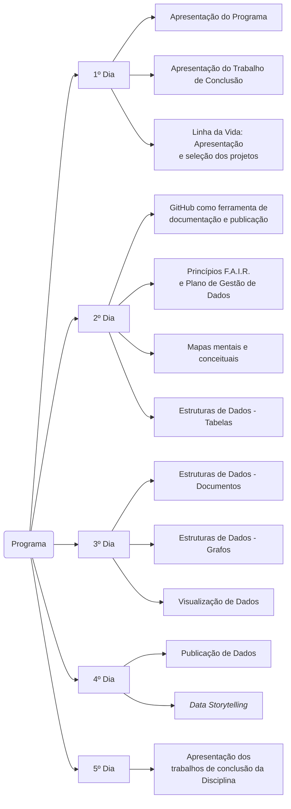

## Gestão de Informação sobre Biodiversidade e Dados de Pesquisa
## EB11302 (antiga EB113)
## Turma 2024 - Período Letivo: 2024/2

### [Programação detalhada](https://github.com/edalcin/eb11302/blob/main/2024/README.md)

