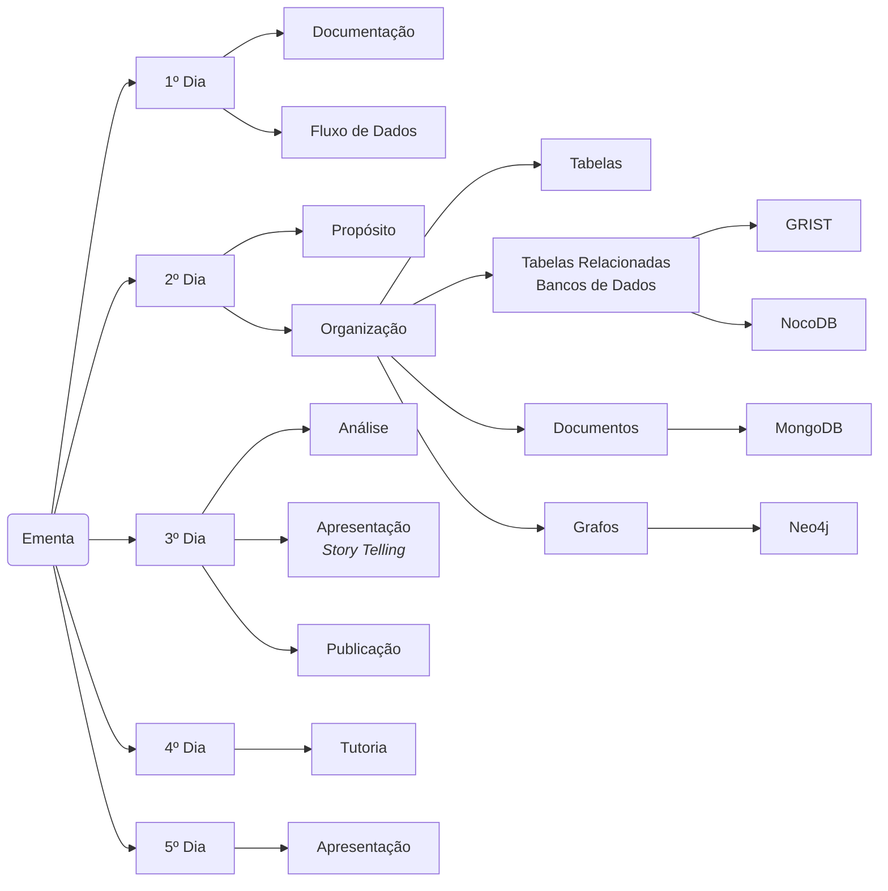

## Proposta de Ementa da Disciplina em 202x

```mermaid
graph LR
    00(Ementa) --> 01[1º Dia]
        01 --> 01.1[Documentação]
        01 --> 01.2[Fluxo de Dados]
    00(Ementa) --> 02[2º Dia] 
        02 --> 02.1[Propósito]
        02 --> 02.2[Organização]
            02.2 --> 02.2.1[Tabelas]
            02.2 --> 02.2.2[Tabelas Relacionadas<br>Bancos de Dados]
                02.2.2 --> 0.2.2.2.1[GRIST]
                02.2.2 --> 0.2.2.2.2[NocoDB]
            02.2 --> 02.2.3[Documentos]
                02.2.3 --> 02.2.3.1[MongoDB]
            02.2 --> 02.2.4[Grafos]
                02.2.4 --> 02.2.4.1[Neo4j]
    00(Ementa) --> 03[3º Dia]
        03 --> 03.1[Análise]
        03 --> 03.2[Apresentação<br><i>Story Telling</i>]
        03 --> 03.3[Publicação]
    00(Ementa) --> 04[4º Dia]
        04 --> 04.1[Tutoria]
    00(Ementa) --> 05[5º Dia]
        05 --> 05.1[Apresentação]
        
```
